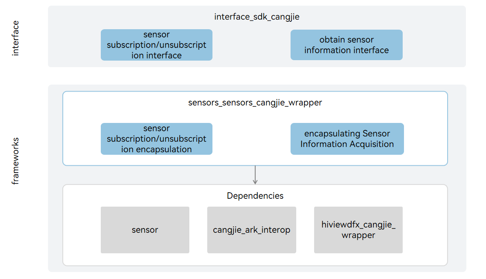

# applications_cangjie_wrapper

## Introduction

The applications_cangjie_wrapper is a Cangjie API encapsulated on OpenHarmony based on the capabilities of the Settings subsystem. The Settings is a system application prebuilt in OpenHarmony. It provides a human-machine interactions entry for users to set system configs like settings system time, lightness of screen and etc,the currently Cangjie open interface for settings only supports standard devices.

## System Architecture

**Figure 1** Architecture of the application_cangjie_wrapper



As depicted in the architecture diagram:

- query time and date settings: Provides an interface for retrieving the currently set time and date data items.  
- query display effect settings: Provides an interface for retrieving the currently set display effect data items.  
- query domain name: Provides an interface for retrieving the domain name.  
- Cangjie applications FFI interface definition: Responsible for defining the C interoperability Cangjie interface, used to implement Cangjie setting application capabilities.  
- application settings: Responsible for providing basic setting application functionalities, encapsulating C interfaces for Cangjie interoperability.

## Directory Structure

```
applications/standard/applications_cangjie_wrapper
├── ohos                       # Cangjie Settings code
       └── settings    
├── kit                        # Cangjie Settings kit code
       └── BasicServicesKit    
└── figures                    # architecture pictures
```

## Instructions For Use

- The following settings functions are provided
  
  - Query time and date settings
  - Query display effect settings
  - Query domain name

- Compared with ArkTS, the following functions are temporarily not supported
  
  - Set time and date
  - Set display effect
  - Register/Unregister domain name specified data item observer
  - Open network management settings page
  - Enable/Disable flight mode
  - Check if the application can be displayed in floating window form

- For the settings APIs, please refer to [ohos.settings (Setting Data Item Names)](https://gitcode.com/openharmony-sig/arkcompiler_cangjie_ark_interop/blob/master/doc/API_Reference/source_en/apis/BasicServicesKit/cj-apis-settings.md).

## Code Contribution

Developers are welcome to contribute code, documentation, etc. For specific contribution processes and methods, please refer to [Code Contribution](https://gitcode.com/openharmony/docs/blob/master/en/contribute/code-contribution.md).

## Repositories Involved

[applications_settings](https://gitee.com/openharmony/applications_settings/blob/master/README.md)  
[arkcompiler_cangjie_ark_interop](https://gitcode.com/openharmony-sig/arkcompiler_cangjie_ark_interop/tree/master/README.md)  
[arkui_arkui_cangjie_wrapper](https://gitcode.com/openharmony-sig/arkui_arkui_cangjie_wrapper/tree/master/README.md)  
[ability_ability_cangjie_wrapper](https://gitcode.com/openharmony-sig/ability_ability_cangjie_wrapper/tree/master/README.md)
