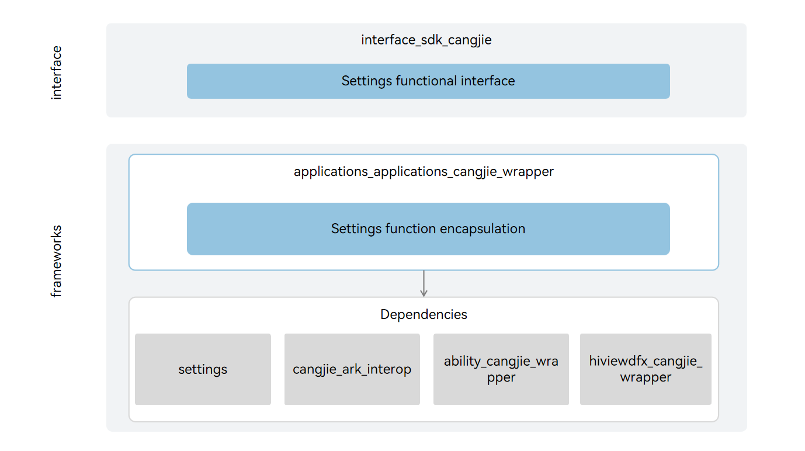

# applications_cangjie_wrapper

## Introduction

The Application Cangjie API is a Cangjie API encapsulated on OpenHarmony based on the capabilities of the Settings subsystem. The Settings is a system application prebuilt in OpenHarmony. It provides a human-machine interactions entry for users to set system configs like settings system time, lightness of screen and etc.

### Architecture



## Directory Structure

```
applications/standard/applications_cangjie_wrapper
├── ohos             # Cangjie Settings code
├── kit              # Cangjie kit code
├── figures          # architecture pictures
```

## Repositories Involved

[applications_settings](https://gitee.com/openharmony/applications_settings/blob/master/README.md)
