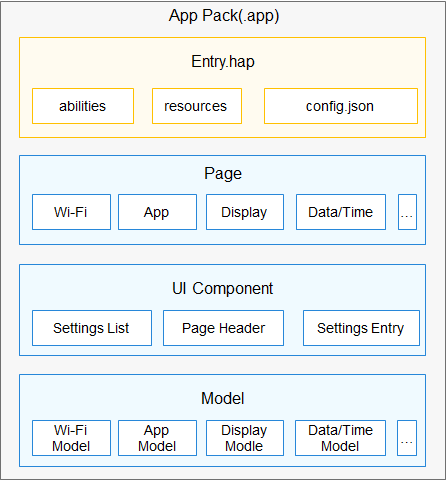

# Settings

## 简介

设置应用是 OpenHarmony 系统中预置的系统应用，为用户提供设置系统属性的交互界面，例如设置系统时间，屏幕亮度等系统属性。

### 架构图



## 目录

```
applications/standard/applications_cangjie_wrapper
├── ohos             # 仓颉Settings接口实现
├── kit              # 仓颉kit化代码
├── figures          # 存放readme中的架构图
```

## 相关仓

applications_cangjie_wrapper

[applications_settings](https://gitee.com/openharmony/applications_settings/blob/master/README.md)
