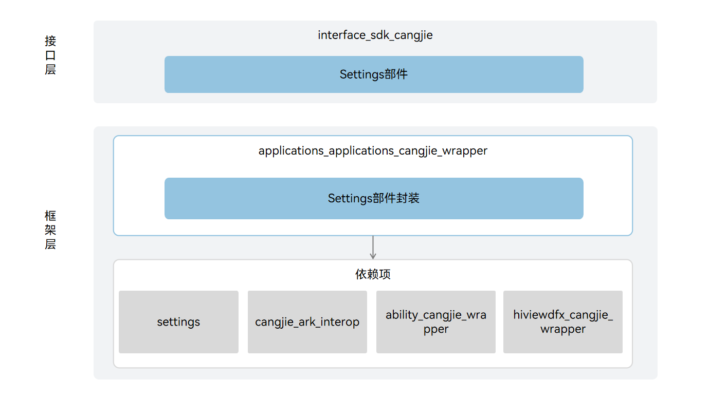

# 应用仓颉封装

## 简介

应用仓颉封装是 OpenHarmony 上面向开发者提供使用仓颉语言进行应用开发时的应用相关能力。当前仓颉提供访问系统属性的能力，例如查询时间和日期、查询显示效果等系统属性，且仅支持 standard 设备。

## 系统架构

**图 1**  应用仓颉架构图




接口层说明:

- Settings功能接口：向开发者提供查询时间和日期能力、获取当前设置的显示效果数据项的能力、获取指定域名数据项的能力。其中域名数据项包含设备属性共享域和用户属性域。

框架层说明:

- Settings功能封装：提供访问系统相关属性的能力。该封装层是基于Settings提供的功能进行的仓颉封装实现。

架构图中的依赖部件引入说明:

- Settings：负责提供设置应用基础功能。
- cangjie_ark_interop：负责提供仓颉注解类定义，用于对API进行标注，以及提供抛向用户的BusinessException异常类定义。
- ability_cangjie_wrapper：负责提供Ability或Application的上下文的基础能力，包括访问特定应用程序的资源等。

## 目录

```
applications/standard/applications_cangjie_wrapper
├── figures                 # 存放README中的架构图
├── kit
│   └── BasicServicesKit    # 仓颉设置应用kit化接口
├── ohos
│   └── settings            # 仓颉设置应用接口实现
└── test
    └── settings            # 仓颉设置应用接口测试代码
```

## 使用说明

提供以下功能：

- 查询时间和日期
- 查询显示效果
- 查询指定的相关域名

设置应用相关API请参见[设置应用API参考](https://gitcode.com/openharmony-sig/arkcompiler_cangjie_ark_interop/blob/master/doc/API_Reference/source_zh_cn/apis/BasicServicesKit/cj-apis-settings.md)，相关指南请参见[设置应用指南](https://gitcode.com/openharmony-sig/arkcompiler_cangjie_ark_interop/blob/master/doc/Dev_Guide/source_zh_cn/settings/cj-settings.md)。

## 约束

与ArkTS提供的API能力相比，暂不支持以下功能：

- 设置时间和日期
- 设置显示效果
- 注册/注销 域名指定数据项观察者
- 打开网络管理设置页面
- 启用/禁用飞行模式
- 检查应用是否能够以悬浮窗形式显示

## 参与贡献

欢迎广大开发者贡献代码、文档等，具体的贡献流程和方式请参见[参与贡献](https://gitcode.com/openharmony/docs/blob/master/zh-cn/contribute/%E5%8F%82%E4%B8%8E%E8%B4%A1%E7%8C%AE.md)。

## 相关仓

[applications_settings](https://gitcode.com/openharmony/applications_settings/blob/master/README_zh.md)

[cangjie_ark_interop](https://gitcode.com/openharmony-sig/arkcompiler_cangjie_ark_interop/blob/master/README_zh.md)

[ability_cangjie_wrapper](https://gitcode.com/openharmony-sig/ability_ability_cangjie_wrapper/blob/master/README_zh.md)
